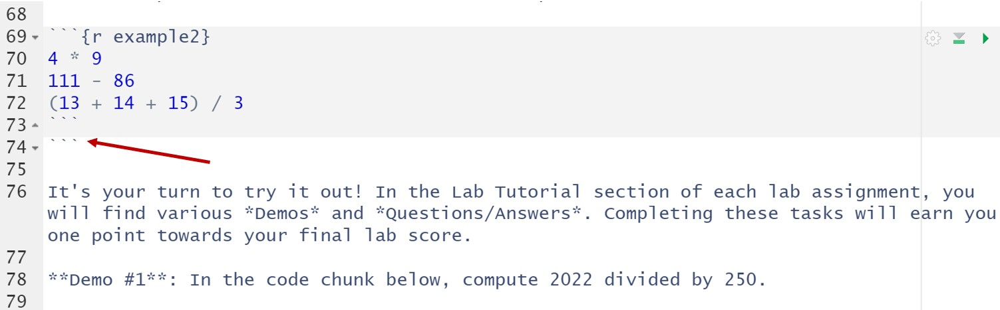
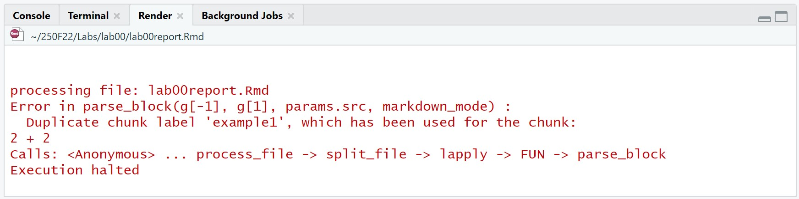
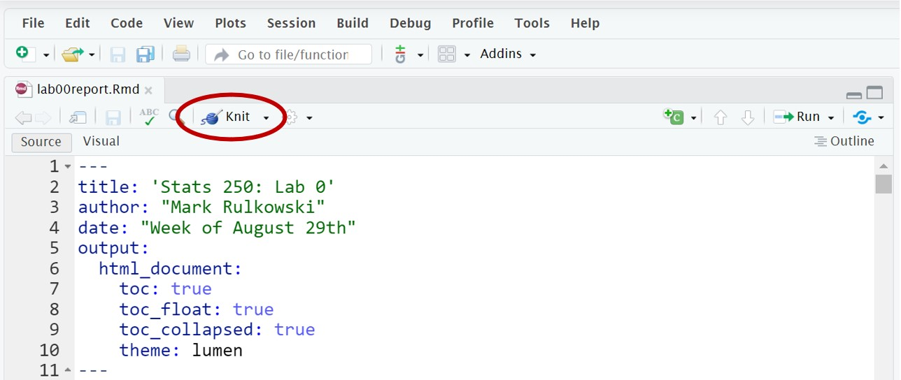
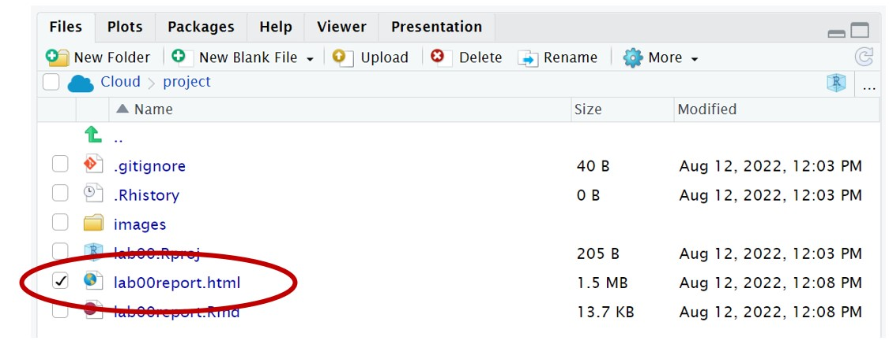
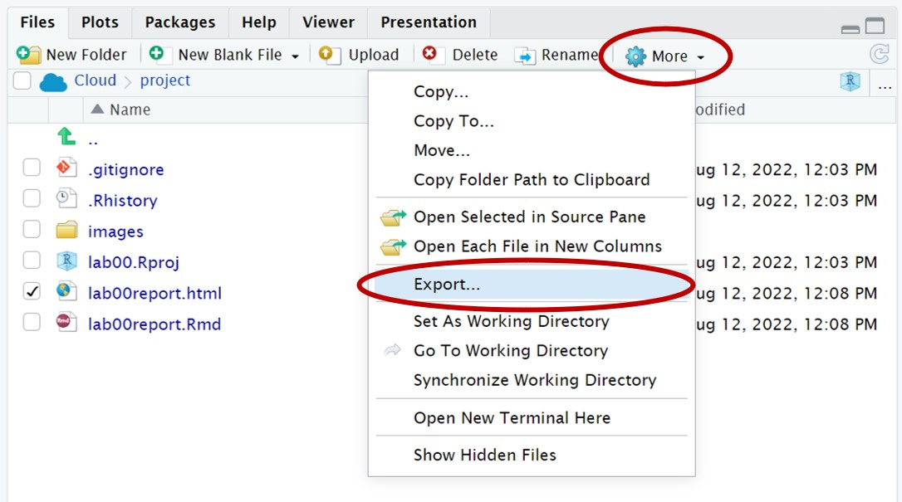
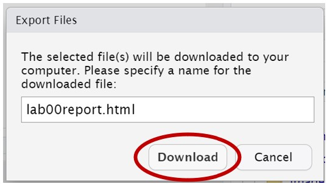

```{r setup, include=FALSE}
knitr::opts_chunk$set(echo = TRUE)
```

## Learning Objectives

1. Learn the difference between R, RStudio, and R Markdown
2. Learn about code chunks and how to use them 
3. Use R as a basic calculator


## Lab Tutorial

### Getting Started: What is R?

In Statistics, we often use computers to analyze data. There are a lot of programs that help perform statistical analyses. One of the most popular (and powerful) is called R. R is a "statistical computing environment" that is designed for manipulating data, generating plots, and performing analyses. R works by writing R code.

That might sound scary, but *don't worry* - this is not a programming class. Over the course of the semester, you will learn how to edit some basic R code to help you analyze data and answer specific research questions. 

There are a lot of "R" words floating around. What's going on?

- *R* is a "statistical computing environment" that's designed for manipulating data, generating plots, and performing analyses. It's also a programming language. You will be writing R code.
- *RStudio* is a pretty interface that makes working with R easier (formally, it is an Integrated Development Environment or IDE for R). If R is ice cream, then RStudio is the cone or cup. You will be writing R code within RStudio.
- *R Markdown* helps create pretty, reproducible analysis reports that combine text, R code, and R output (plots, analysis results, etc.) - all in one nicely formatted document. This document is an R Markdown file! You will be working with R Markdown files by editing R code within RStudio. (If you would like to learn more, you can find more details on using R Markdown at <http://rmarkdown.rstudio.com>.)

This might seem confusing at first and that is okay! It will start to make sense as we get more experience with all three.


### Knitting

As noted above, an R Markdown file produces a pretty report. But right now this file probably doesn't seem too pretty. To create a nicely formatted report, we have to "Knit" the R Markdown file. To "Knit" this document, click the "Knit" button at the top of the file. Try it now!

A new window should appear with your knitted HTML file - and it should look a lot nicer! This is the file that will get submitted to Canvas upon completion of the lab assignment. It is good practice to knit often while working through the lab assignment (this can help identify errors sooner rather than later). 


### Code Chunks

The above information has all been text. (The text has some unique formatting, but it is still just text). To run code in an R Markdown document, we need to create a *code chunk*. A code chunk looks like this:

```{r example1}
2 + 2
```

**IMPORTANT:** A code chunk...

- must start and end with three backticks (```)
- must have a *unique* name (the code chunk above is named "example1")

To run a code chunk, click the green play button in the upper right corner of the code chunk. The number "4" should appear as the output. (You may ignore the [1] that gets displayed with the answer, it is not important right now.) 

At its most basic function, R is a fancy calculator. You can perform calculations using standard operators. Let's see a few examples.

```{r example2}
4 * 9
111 - 86
(13 + 14 + 15) / 3
```

It's your turn to try it out! In the Lab Tutorial section of each lab assignment, you will find various *Demos* and *Questions/Answers*. Completing these tasks will earn you one point towards your final lab score. 

**Demo #1**: In the code chunk below, compute 2022 divided by 250. You will notice the chunk contains the text `# Replace this text with the code!`. This is called a "comment". A comment is text that helps explain your code, but it is not code. Feel free to delete and replace this comment, or type your code in the line after the comment. 

```{r demo1}
# Replace this text with your code!

```

**Question:** What is the name of the code chunk above?

**Answer:** Replace this text with your answer.

Before we cover a few more topics, we want to discuss the most common errors students run into.


### Common Errors (Please Read)

The two most common errors arise from copying and pasting. While we encourage students to copy, paste, and edit the examples provided, you must be very careful with what gets copied and pasted.  

As noted earlier, a code chunk starts and ends with three backticks (```) -- this is **very** important. This is how R Markdown knows where your chunk starts and stops. If you include too few or too many backticks, you will run into issues. Note: a backtick can be found right below the Esc key on a US English keyboard.

One common error is to copy and paste extra backticks after (or before) a code chunk, as shown below.

{width=600px}

When this happens, the R Markdown file may not work properly. In the picture above, we can see that the text below the extra backticks becomes gray. It's also possible that the green play button for subsequent code chunks disappear. 

To fix this issue, simply delete the extra backticks! And if a green play button ever disappears, scroll up through your R Markdown file until you find the extra backticks (which should be right above any gray text).

The other common error is duplicating a chunk name (reusing a chunk name). This arises from copying and pasting an entire code chunk, including the chunk name. Each code chunk must have a *unique* name, otherwise the R Markdown file will fail to knit.  

Suppose we copied and pasted the entire `example1` code chunk below. If we then tried to knit the document, we would get the following error. 

{width=600px}

To fix this issue, simply change the name of the code chunk to something unique! Renaming it to `example3` (or any other name that isn't used elsewhere in the document), will fix the problem.  

If you ever run into issues with your code, reach out to your GSI or post a screenshot of your issue/error to Piazza. The instructional team is here to help!


### Storing Results

What happens if we want to store the answers to a calculation? We can give the result of some code a name by **assigning** it to something. Below, we will assign the result of 5 times 7 to the letter x.

```{r assignmentExample}
x <- 5 * 7
```

We read this code as "x gets 5 * 7". The arrow is made using the less-than symbol (`<`) and a hyphen (`-`). R will now remember that `x` is 35. In your environment (the top right window), you should now see a "value" called `x`. 

You can access the value of `x` by typing `x` into R. Check it out:

```{r accessingExample}
x
```

**NOTE:** R is "case-sensitive", which means that upper-case letters are *different than* lower-case letters. Notice what happens when we ask R for the value of `X`:

```{r errorExample, error = T}
X
```

When giving things names in R, you can only use a combination of letters, numbers, periods, and underscores. The names have to start with a letter or a period and cannot contain spaces. The simpler the name, the better.

In addition to storing simple numeric results, you can store other objects (such as text and data sets) using this same assignment technique. 

**Demo #2**: In the code chunk below, store the result of 8 times 29 as a lowercase y. 

```{r demo2}
# Replace this text with your code!

```

Once you run this code chunk, you should see your stored result in your environment (the top right window).


### Function Syntax

We will primarily work with R through the use of *functions*. R has a multitude of built-in functions to help us easily perform various tasks and statistical analyses. A function generally has the follwing form: 

```{r functionSyntax, eval = F}
functionName(argument1, argument2, ...)
```

We have the name of the function, followed immediately by an open parenthesis, a sequence of *arguments*, and a close parenthesis. Each argument is separated with a comma.

Let's use the `read.csv()` function to read in a data set (and see an example of a function in action). 


### Reading in Data

The `read.csv()` function helps us read in a ".csv" file into our environment. With the help of our assignment syntax (`<-`) and the `read.csv()` function, we will store the data set as `penguins`. 

```{r readExample}
penguins <- read.csv(file = "penguins.csv", header = TRUE)
```

We used two arguments with the `read.csv()` function above. The first argument (file) was the name of the file. We can find the name of the file in the file window (the lower right window). The second argument (header) tells R whether the file has variable names at the top of the provided file (this file does, but you wouldn't know that). 

This function has several other potential arguments that we could supply to R, but it is typically unnecessary. These alternate arguments have built-in defaults that generally do the trick. We will always tell you if you need to specify an argument! 


### Viewing the Data

The `penguins` data set contains information on 333 penguins collected from three islands in the Palmer Archipeligo in Antarctica (see References at the bottom of the R Markdown file for more information). 

To view this data, click on the text "penguins" in the environment (the top right window). Clicking on the stored data set name will open up a new window for you to view the data set. Additionally, we can click on the blue circle next to the data set name to see a list of variable names. We will learn other functions that help us view the stored data set in Lab 1. 

**Question:** How many variables does the penguins data set have?

**Answer:** Replace this text with your answer.

That's all we are going to learn for today. Over the course of the semester, we will learn to create tables/plots, calculate numerical summaries, and run an abundance of statistical tests. When questions arise, please do not hesitate to reach out to our instructional team - we are here to help!


***


## Try It!

Complete the following exercises. The "Try It" questions will typically be code-based and will be graded for completeness - give *every* question your best shot! 

> **1.** In the code chunk below, multiply 250 by your lab's section number. 

```{r tryIt1}
# Replace this text with your code!

```


> **2.** Which of the variables in `penguins` are *quantitative* (or numeric)? List the names of the quantitative variables below. If you are unsure, give it your best shot! These Try It questions are graded for *completeness*. 

*Answer:* Replace this text with your answer.


> **3.** One of the most common errors is copying and pasting extra backticks before or after a code chunk. What is the other common error that was discussed in the lab tutorial? 

*Answer:* Replace this text with your answer.


***


## Dive Deeper

This section of the lab will have you "dive deeper" into the analysis. This section will involve two questions that are graded for *correctness*. (For Lab 0, these questions will be graded for *completeness*.)  

> **1.** After Lab 0, how do you feel about using R? Do you have any major concerns moving forward with Stats 250?

*Answer:* Replace this text with your answer (1-2 sentences).


> **2.** How do you think statistics will help you in your major or future career?

*Answer:* Replace this text with your answer (1-2 sentences).


***


## Submission Instructions

Carefully follow the instructions below to properly submit your completed work.

1. At the top of the document, change the `author` field to your name (in quotes!). Do not change anything else at the top of the document.

2. When you have finished the lab, click the **Knit** button one last time.

{width=500px}

3. In the Files pane (bottom right window), check the box next to `lab00report.html`: 

{width=400px} 

4. Click More > Export. Note: you may have to resize the Files pane to find "More".

{width=400px} 

5. **Do not change the file name (lab00report.html)** Click Download and save the file to your computer.

{width=300px}

6. On the Stats 250 Canvas site, click "Assignments" on the left side of the page. Scroll to find "Lab 0" and open the assignment. Click "Submit Assignment".

7. At the bottom of the page, upload your saved `lab00report.html` file. Note: you will only be able to upload a .html file

8. Click "Submit Assignment". You completed Lab 0 - give yourself a high five!


## References

Data were collected and made available by [Dr. Kristen Gorman](https://www.uaf.edu/cfos/people/faculty/detail/kristen-gorman.php) and the [Palmer Station, Antarctica LTER](https://pal.lternet.edu/), a member of the [Long Term Ecological Research Network](https://lternet.edu/), and the data were prepared by [Dr. Allison Horst](https://github.com/allisonhorst/palmerpenguins).
